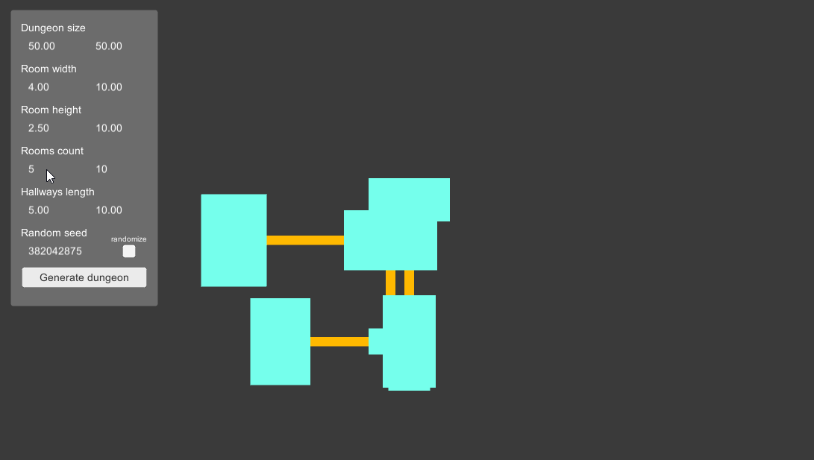

# Procedural Generation

This is the second gold achievements for the Game Programming class in THUAS'
Game Development & Simulation minor.

## Instructions

Implement a 2D dungeon generator using your own algorithm. The dungeon consists
of rooms that are connected by hallways. Each room has their own size, and not
all rooms are the same size. Hallways are of width 1, but their length can vary.
Hallways are allowed to cross.  
Rooms are allowed to overlap to form bigger, non-rectangle rooms.

The player can input:

- the size of the dungeon
- a range for the size of the rooms
- a range for the amount of rooms spawned
- a range for the length of the hallways

### Result

  
  
<i>Project demo</i>

## Credits

This project is the work of [Adrien Lucbert](https://github.com/adrienlucbert),
and the Game Programming class was given by Mathijs Koning..
